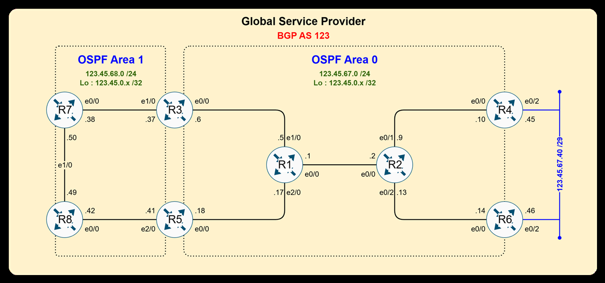
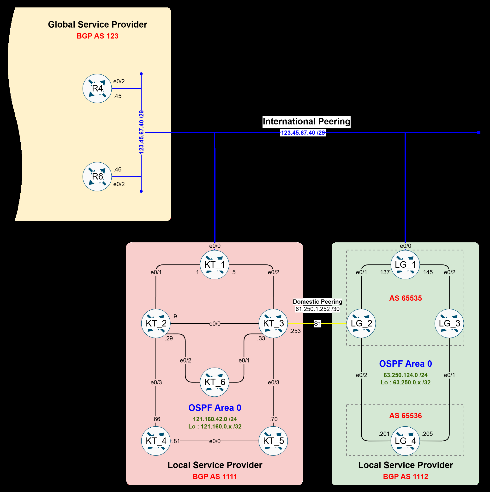
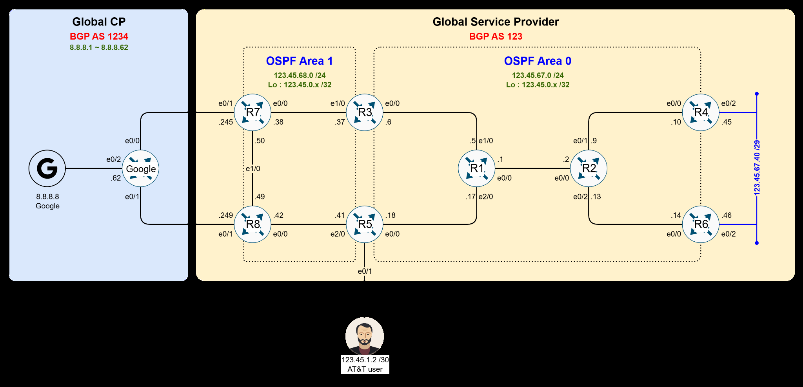
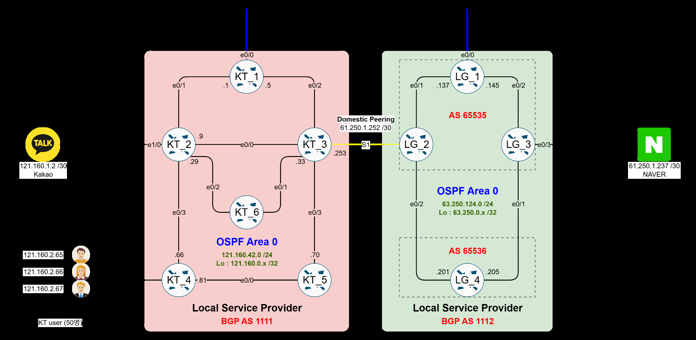

# R&S Final 중급 실기 — 통신사 네트워크 구성

> RAPA R&S 과정 중급 실기 문제: Global SP / Local SP / CP / User 네트워크 전체 구성

---

## 목차

1. [전체 구성 개요](#전체-구성-개요)
2. [Global SP 구성 (AT&T)](#global-sp-구성-att)
3. [Local SP 구성 (KT / LG)](#local-sp-구성-kt--lg)
4. [Global CP & User 구성](#global-cp--user-구성)
5. [Local CP & User 구성](#local-cp--user-구성)
6. [제출 항목](#제출-항목)

---

## 전체 구성 개요

| 구분 | 사업자 | BGP AS | 역할 |
|------|--------|--------|------|
| Global SP | AT&T | AS 123 | 글로벌 백본 (P/PE 구조) |
| Local SP | KT | AS 1111 | 국내 ISP |
| Local SP | LG | AS 1112 (Sub AS: 65535, 65536) | 국내 ISP |
| Global CP | Google | AS 1234 | 글로벌 콘텐츠 제공자 |

---

## Global SP 구성 (AT&T)

### 토폴로지



### 장비 역할

| 장비 | 역할 | 설명 |
|------|------|------|
| R1, R2 | P (Provider) | SP Core 장비, Route Reflector |
| R3 ~ R8 | PE (Provider Edge) | SP Edge 장비, Route Reflector Client |

### 네트워크 설계

| 항목 | 값 |
|------|----|
| 내부 구간 Network | `123.45.67.0/24`, `123.45.68.0/24` |
| Loopback0 | `123.45.0.X/32` (X = 라우터 번호) |
| OSPF Area 0 | R1, R2, R3, R4, R5, R6 |
| OSPF Area 1 | R3, R5, R7, R8 |

### 구성 조건

- **IGP**: OSPF — Loopback0 광고 (R4, R6의 `e0/2` 제외)
- **prefix-suppression**: 불필요한 구간 네트워크 광고 차단
- **iBGP**: Loopback0 기반 Neighbor 설정
  - P 장비 (R1, R2): **Route Reflector**
  - PE 장비 (R3~R8): **Route Reflector Client**

---

## Local SP 구성 (KT / LG)

### 토폴로지



### KT (BGP AS 1111)

| 항목 | 값 |
|------|----|
| 구간 Network | `121.160.42.0/24` |
| Loopback0 | `121.160.0.X/32` (X = 라우터 번호) |
| OSPF | Area 0 |

### LG (BGP AS 1112)

| 항목 | 값 |
|------|----|
| 구간 Network | `63.250.124.0/24` |
| Loopback0 | `63.250.0.X/32` (X = 라우터 번호) |
| Sub AS | 65535, 65536 |
| OSPF | Area 0 |

### 공통 조건

- IGP: OSPF — Loopback0 광고, 불필요한 구간 Network 광고 차단
- **eBGP**: 물리 인터페이스 사용
- **iBGP**: Loopback0 사용, 필요시 Route Reflector 구성

### 피어링

| 구분 | 내용 |
|------|------|
| **Domestic Peering** (국내) | KT_3 ↔ LG_2, Serial 인터페이스, `61.250.1.252/30` |
| **International Peering** (국제) | AT&T ↔ KT/LG, `123.45.67.40/28` |

---

## Global CP & User 구성

### 토폴로지



| 항목 | 값 |
|------|----|
| Global CP (Google) | BGP AS 1234, `8.8.8.1 ~ 8.8.8.62` |
| Global User Network | `123.45.1.0/24` (AT&T 할당) |

### 노드 구성

```bash
# Global CP (Docker)
docker run apache2:latest
echo Welcome to Google > /var/www/html/index.html

# Global User
# VPC 또는 Ubuntu_sv:latest (Docker)
```

---

## Local CP & User 구성

### 토폴로지



| 사업자 | CP Network | User Network |
|--------|-----------|-------------|
| KT | `121.160.1.0/24` | `121.160.2.0/24` |
| LG | `61.250.1.0/24` | `61.250.2.0/24` |

### 노드 구성

```bash
# KT CP (Docker)
docker run apache2:latest
echo Welcome to KAKAO > /var/www/html/index.html

# LG CP (Docker)
docker run apache2:latest
echo Welcome to NAVER > /var/www/html/index.html

# Local User
# VPC 또는 Ubuntu_sv:latest (Docker)
```

---

## 제출 항목

### Configuration

- [ ] `show run | sec ospf`
- [ ] `show run | sec bgp`
- [ ] `show int des`

### Global & Local SP

- [ ] OSPF Neighbor Table
- [ ] OSPF Routing Table
- [ ] BGP Neighbor Table
- [ ] BGP Table
- [ ] BGP Routing Table

### User ↔ CP 통신

- [ ] Local User → Local CP 통신 Flow 및 학습 경로
- [ ] Local User → Global CP 통신 Flow 및 학습 경로
- [ ] Global User → Local CP 통신 Flow 및 학습 경로
- [ ] Global User → Global CP 통신 Flow 및 학습 경로
